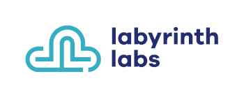

# terraform-aws-regional-vpc-peering
# AWS Regional VPC peering

We help companies build, run, deploy and scale software and infrastructure by embracing the right technologies and principles. Check out our website at https://lablabs.io/

---

## Description

A terraform module to create AWS Flow log resources.

<!-- BEGINNING OF PRE-COMMIT-TERRAFORM DOCS HOOK -->
## Requirements

| Name | Version |
|------|---------|
| terraform | >= 0.13 |

## Modules

No Modules.

## Resources

| Name |
|------|
| [aws_caller_identity](https://registry.terraform.io/providers/hashicorp/aws/latest/docs/data-sources/caller_identity) |
| [aws_region](https://registry.terraform.io/providers/hashicorp/aws/latest/docs/data-sources/region) |
| [aws_route](https://registry.terraform.io/providers/hashicorp/aws/latest/docs/resources/route) |
| [aws_route_tables](https://registry.terraform.io/providers/hashicorp/aws/latest/docs/data-sources/route_tables) |
| [aws_vpc](https://registry.terraform.io/providers/hashicorp/aws/latest/docs/data-sources/vpc) |
| [aws_vpc_peering_connection](https://registry.terraform.io/providers/hashicorp/aws/latest/docs/resources/vpc_peering_connection) |
| [aws_vpc_peering_connection_accepter](https://registry.terraform.io/providers/hashicorp/aws/latest/docs/resources/vpc_peering_connection_accepter) |
| [aws_vpc_peering_connection_options](https://registry.terraform.io/providers/hashicorp/aws/latest/docs/resources/vpc_peering_connection_options) |

## Inputs

| Name | Description | Type | Default | Required |
|------|-------------|------|---------|:--------:|
| accepter\_vpc\_id | The ID of the VPC with which you are creating the VPC Peering Connection. | `string` | n/a | yes |
| requester\_vpc\_id | The ID of the requester VPC. | `string` | n/a | yes |
| accepter\_options | An optional configuration block that allows for VPC Peering Connection options to be set for the VPC that accepts the peering connection (a maximum of one). | `map(string)` | `{}` | no |
| accepter\_route\_table\_ids | A list of route table ids within the accepter VPC to attach the peering route to. If not present all route tables in the VPC will be updated. | `list(string)` | `[]` | no |
| accepter\_tags | Tags to add to the accepter side resources of the connection. | `map(string)` | `{}` | no |
| requester\_options | A optional configuration block that allows for VPC Peering Connection options to be set for the VPC that requests the peering connection (a maximum of one). | `map(string)` | `{}` | no |
| requester\_route\_table\_ids | A list of route table ids within the requester VPC to attach the peering route to. If not present all route tables in the VPC will be updated. | `list(string)` | `[]` | no |
| requester\_tags | Tags to add to the requester side resources of the connection. | `map(string)` | `{}` | no |
| route\_ipv6 | Creates ipv6 routes in addition to the standard ipv4 routes | `string` | `false` | no |

## Outputs

| Name | Description |
|------|-------------|
| accept\_status | The status of the VPC Peering Connection request. |
| id | The ID of the VPC Peering Connection. |
<!-- END OF PRE-COMMIT-TERRAFORM DOCS HOOK -->

## Contributing and reporting issues

Feel free to create an issue in this repository if you have questions, suggestions or feature requests.

Credits [QuiNovas](https://github.com/QuiNovas/terraform-aws-vpc-peering)

### Validation, linters and pull-requests

We want to provide high quality code and modules. For this reason we are using
several [pre-commit hooks](.pre-commit-config.yaml) and
[GitHub Actions workflow](.github/workflows/main.yml). A pull-request to the
master branch will trigger these validations and lints automatically. Please
check your code before you will create pull-requests. See
[pre-commit documentation](https://pre-commit.com/) and
[GitHub Actions documentation](https://docs.github.com/en/actions) for further
details.

## License

See [LICENSE](LICENSE) for full details.

    Licensed to the Apache Software Foundation (ASF) under one
    or more contributor license agreements.  See the NOTICE file
    distributed with this work for additional information
    regarding copyright ownership.  The ASF licenses this file
    to you under the Apache License, Version 2.0 (the
    "License"); you may not use this file except in compliance
    with the License.  You may obtain a copy of the License at

      https://www.apache.org/licenses/LICENSE-2.0

    Unless required by applicable law or agreed to in writing,
    software distributed under the License is distributed on an
    "AS IS" BASIS, WITHOUT WARRANTIES OR CONDITIONS OF ANY
    KIND, either express or implied.  See the License for the
    specific language governing permissions and limitations
    under the License.
